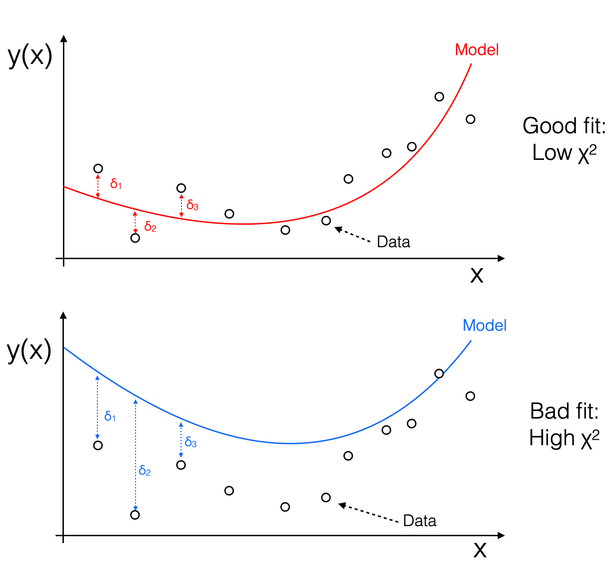
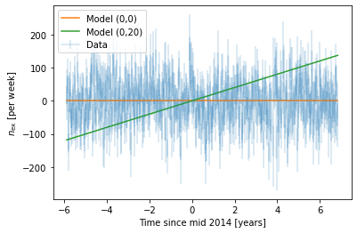
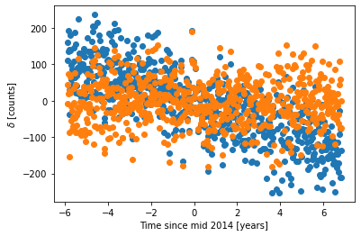
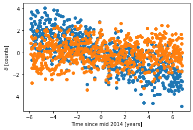
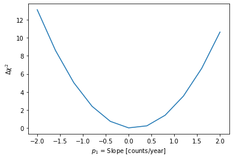

# Notes and materials for Week 5

Topics covered: Correlation and least-square fitting.

* Announcements and information
  * Follow up from week 4 Lab.  Comments [here](Week4_after.md)

* Course material
  * [Data analysis topics](#Data%20analysis%20topics)
  * [Scientific context](#Scientific%20context%20and%20resources)
  * [Python functions and tools reference](#Python%20functions%20reference)
  * [Template for "report" questions](https://docs.google.com/document/d/1CRDavwRu1C37xg2_VFTXRthc-K03MIzdrciGSMwUf1g/edit?usp=sharing)

## Data analysis topics

This week we are going to be discussing covariance and correlations between data points, and how to perform least-squares fitting.

### Covariance

Covariances are actually very similar to variances, expect they tell about if two variables tend to

The variance given a set of values (`x_i`, where i is the index of the values) is:
	\sum_i (x_i - mu_x)(x_i - mu_x)/n

The covariance given a set of pairs of values (`x_i`, `y_i`) is: 
	\sum_i (x_i - mu_x)(y_i - mu_y)/n

Where `mu_x` and `mu_y` are the mean of the x and y values.

If very high values of x tend to pair with very high values of y, then the covariance will be large and positive.

If very low values of x tend to pair with very low values of y, then the covariance will be large and negative.

If x and y values tend to be independent of each other, then the covariance will be small.

### Least squares fitting

Least square fitting is a type of model fitting. This relies on looking at the squared differences between the data points and the model (i.e. the "residuals") and using these to estimate how well the two agree. The "best" fits are those with small squared residuals.

#

Basically what we do is we make a model with some free parameters that could describe some data we have.

Our model in this class will be that there is a linear trend as a function of time in the excess counts seen from the Vela pulsar.
I.e., that the pulsar is either getting brighter or fainter, and doing so linearly with time.

What we will then do is to vary the parameters of our model to produce the best possible fit to the data.

The criterion by which we decide how good a fit a particular set of model parameters provide is the $\chi^2$, which
is the sum of the squares of the error-scaled residuals.

So, in short, what we will be doing is computing the residuals (i.e., data-model) for each week of data, scaling
those residuals by the errors for that week, squaring them, and summing them all together to obtain a measure
of how well the model fits the data given those parameter values.

Here is a visual explanation of the process.

The data and the model for a couple of different values of the model parameter that give the slope of the trend line.

The residuals (i.e., data-model) for all of the data points, plotted versus time, for both versions of the model.

The scaled residuals (i.e., (data-model)/error ) for all of the data points, plotted versus time, for both version of the model.

A histogram of the scaled residual values, for both version of the model.

The `chi**2` is the sum of the squares of the values in that histogram.  (Note that is also equal to the variance of the histogram
times the number of data points).

Here is the `chi**2` plotted versus several different values for the slope parameter.  What we are trying to do is pick the value that minimize the `chi**2`.

You can also think about that as trying to minimize the variance of the distribution of the scaled residuals.

## Scientific context and resources

In the second Jupyter notebook we will be using the output of some data analysis done using data from the Fermi Gamma-ray space Telescope.  It is the same data we used last
week; except this time we will be looking for a long-term trend in the Vela pulsar, to see if it is slowly getting brighter or fainter.

## Python functions reference

We will not be using a lot of new python functions this week.  Here
are the important ones that we will be using.

| Function Name            | What it does |
| - | - |
| plt.figure               | Make a matplotlib figure, useful for making figures with subplots |
| fig.subplots             | Makes subplots for a figure |
| np.cov                   | Compute the covariance matrix between multiple data series |
| np.corrcoef              | Compute the correlation coefficient between multiple data series |
|  plt.contour |  Make a contour plot, ie., show the contours correspond to a series of values |
| scipy.stats.minimize | Find the parameter values that minimize a user-provided "cost function" |
| scipy.stats.chi2 | Interact with a $\chi^2$ distribution, e.g., to compute a p-value |

<!--  LocalWords:  numpy.var plt.imshow plt.colorbar plt.legend
 -->
<!--  LocalWords:  numpy.std Jupyter plt.annotate matplotlib
 -->
<!--  LocalWords:  np.argmax
 -->
