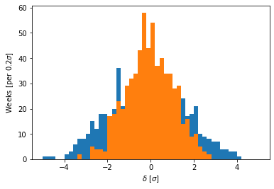

# Follow up notes for week 4..

### Model fitting and chi-squared.

Two weeks ago we learned about how to characterize the significance of data using
a Gaussian distribution.

Last week we extended that to how to find the values of model parameters that give you the best
agreement between data and a model.

Basically what we do is we make a model with some free parameters that could describe some data we have,
and then vary those parameters so that the model comes as close as possible to each data point.

In short, what we are doing is treating the difference between each data point and the model prediction for that point
as a Gaussian distribution by scaling each difference by the expected uncertainty.

If we make a histogram of those scaled differences we get something like this:

The `chi**2` is the sum of the squares of the values in that histogram.  (Note that is also equal to the variance of the histogram
times the number of data points).

Here is the `chi**2` plotted versus several different values for the slope parameter.  What we are trying to do is pick the value that minimize the `chi**2`.

You can also think about that as trying to minimize the variance of the distribution of the scaled residuals.

The final thing we did last week was to optimize two parameters in a single model by scanning over both parameters and making a map of the `chi**2`.

This week we are going use an algorithm do find the parameter values instead of doing a multi-dimensional scan.
