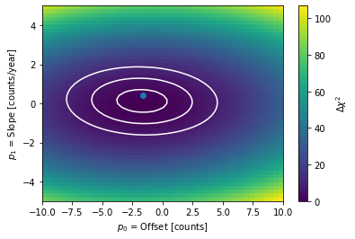
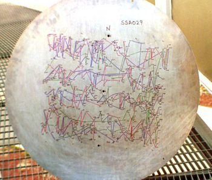

# Notes and materials for Week 6

Topics covered: Least-squares fitting with a function minimizer.

* Announcements and information
  * Follow up from week 5 Lab.  Comments [here](Week5_after.md)

* Course material
  * [Data analysis topics](#Data%20analysis%20topics)
  * [Scientific context](#Scientific%20context%20and%20resources)
  * [Python functions and tools reference](#Python%20functions%20reference)
  * [Template for "report" questions](https://docs.google.com/document/d/19mRvJSlbUk6q--IAmry5HzSBmCo70HUEfH-9e6g_VHA/edit?usp=sharing)

## Data analysis topics

This week we are going to be how to perform least-squares fitting with a function minimizer.

### Least squares fitting

Last week we saw that we could estimate the model parameters that gave the best agreement to the data by scanning over the
parameters and computing the `chi**2` for each value of the parameter.

We also did this for two parameters at once.  That gave us a plot that looks like this:

This week we are going to use an algorithm that finds the set of parameters that minimize the `chi**2` and give the best fit.

There are a number of different algorithms that can find the parameters that minimize the `chi**2`.  What they have in common is that
they start out with an initial guess, and then try to improve on that guess until they believe that they are very close to the best
solution.  The details of how the algorithm works are well beyond the scope of this class, but this is a very useful tool to be familiar with.

## Scientific context and resources

In the second Jupyter notebook we will be using the output of some data analysis done using the spectrum of a distant object as
measured by the Sloan Digital Sky Survey.

Over the course of 20 years, SDSS observed 35% of the sky and cataloged about 1 billion stars and galaxies.

It addition to taking images of such a large part of the sky, SDSS also measured the spectrum of the light from over 4 million objects.  

The spectra show the energy flux (i.e., the amount of energy per area, per time) as a function of wavelength for two objects.

The spectra are obtained by feeding an individual optical fibre for each target through a hole drilled in an aluminum plate.  The light from the fiber is then passed into a diffraction grating to separate out the different wavelength so that the spectrum for that target can be measured.   The diffracted light was the directed to an array of sensors, so that each sensor measured the amount of light at a different wavelength.

Each hole is positioned specifically for a selected target, so every field in which spectra are to be acquired requires a unique plate.  In spectroscopic mode, the telescope tracks the sky in the standard way, keeping the objects focused on their corresponding fibre tips. 

Here is a picture of one such aluminum plate:

Here are a couple of spectra:

The figures have been helpfully annotated, showing the lines that correspond to particular atomic transitions.  By comparing
the measured wavelength of the lines with the know emission wavelength we can measure the dopper shift for each object.

## Python functions reference

We will not be using a lot of new python functions this week.  Here
are the important ones that we will be using.

| Function Name            | What it does |
| - | - |
| scipy.optimize.minimize  | Find the set of parameters that minimize a cost function |

<!--  LocalWords:  Jupyter plate-sdss.jpg sdss_spec_1.png
 -->
<!--  LocalWords:  sdss_spec_2.png
 -->
